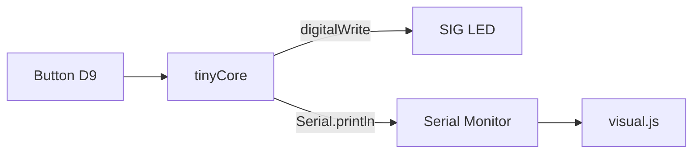

# led_pulse

Pulse an external LED on button press.

Built with **tinyStudio** for the **tinyCore** ESP32-S3 board by MR.INDUSTRIES.

## What it does

- [x] Reads the input
- [x] Drives the `SIG` LED
- [ ] Streams state over serial at `115200` baud

## Signal flow

## Pin map

| Signal | Pin | Direction |
|--------|-----|-----------|
| LED    | SIG | output    |
| Button | D9  | input ⤓   |

## Build

1. **Verify** to compile.
2. **Upload** to your connected tinyCore.
3. Open the **Visual** tab to graph the serial output live.
